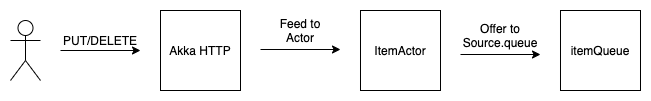

# Scala Akka Http Request Streaming

The intention of this codebase is to figure out how to feed Akka HTTP requests to an Akka Source.

This has been achieved by feeding Akka HTTP requests to an Actor which then offers the request information (a String) to a queue (`Source.queue`).

I considered using `Source.actorRef` initially (instead of `Source.queue`), however this did not offer backpressure, therefore I felt that `Source.queue` was generally a better option.

I also looked into `Source.actorRefWithBackpressure` however I couldn't figure out how to get this to work without also needing an accompanying `Sink.actorRefWithBackpressure` (see example 10 [here](https://www.programcreek.com/scala/akka.stream.OverflowStrategy)), which defeated the object of this exercise.

### Routes
* Add item: `curl -X PUT http://localhost:8080/item/abc`
* Delete item: `curl -X DELETE http://localhost:8080/item/abc`

### Sources:
* https://alvinalexander.com/scala/akka-actors-introduction-tutorial-101/
* https://doc.akka.io/docs/akka/current/stream/operators/Source/actorRef.html
* https://doc.akka.io/docs/akka/current/stream/operators/Source/actorRefWithBackpressure.html
* https://doc.akka.io/docs/akka/current/stream/actor-interop.html#source-queue